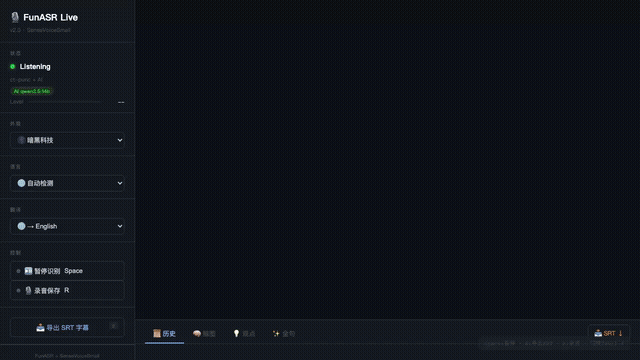
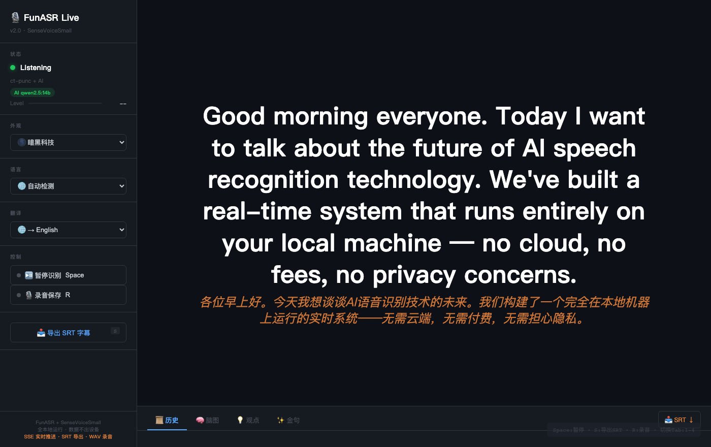
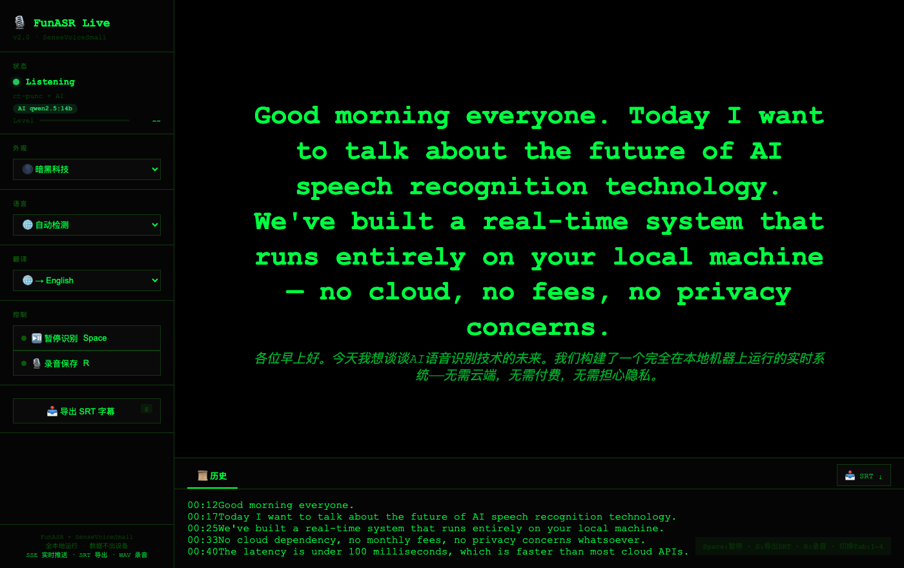
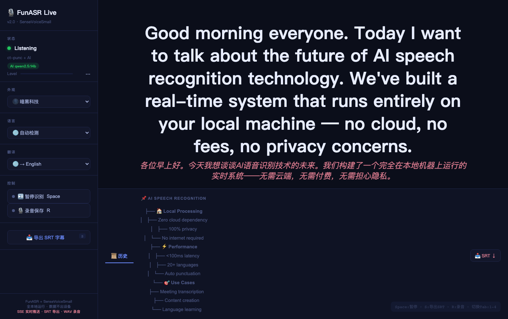
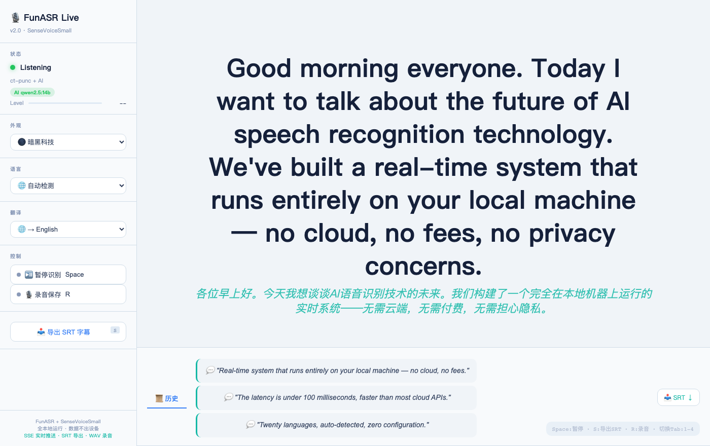

# 🎙️ Kev.FunASR v2.0

<p align="center">
  
  
  
  
  
  
  
</p>

<p align="center">
  <b>Real-time speech-to-text. One Python file. No cloud. No fees.</b><br>
  <sub>Compare: <a href="#-kevfunasr-vs-original-funasr">Kev.FunASR vs Original FunASR</a> · <a href="#-kevfunasr-vs-cloud-apis">vs Cloud APIs</a> · <a href="#-kevfunasr-vs-desktop-apps">vs Desktop Apps</a></sub>
</p>

<p align="center">
  <b>🇺🇸 English</b> · <a href="README_zh.md">🇨🇳 中文</a> · <a href="README_ja.md">🇯🇵 日本語</a> · <a href="README_ko.md">🇰🇷 한국어</a> · <a href="README_es.md">🇪🇸 Español</a> · <a href="README_fr.md">🇫🇷 Français</a> · <a href="README_de.md">🇩🇪 Deutsch</a> · <a href="README_pt.md">🇧🇷 Português</a> · <a href="README_ru.md">🇷🇺 Русский</a>
</p>

<p align="center">
  
</p>

---

## ⚡ TL;DR

> FunASR is great as an engine. **Kev.FunASR** is what happens when you turn that engine into a product people actually want to use.

- **FunASR gives you:** a Python library that recognizes speech
- **Kev.FunASR gives you:** a complete app with UI, export, recording, AI summary, translation, and one-command startup

---

## 📊 Kev.FunASR vs Original FunASR

FunASR is Alibaba's open-source ASR engine. Here's what **we added** to make it a product:

<table>
<tr><th></th><th>FunASR (engine)</th><th>Kev.FunASR (this repo)</th></tr>
<tr><td>Run it</td><td>Python scripts + config</td><td>✅ <code>python3 funasr_live.py</code> — done</td></tr>
<tr><td>User interface</td><td>❌ Command-line only</td><td>✅ Full Web UI · 20 themes</td></tr>
<tr><td>Microphone input</td><td>❌ Manual setup</td><td>✅ Auto ffmpeg · BT HFP support</td></tr>
<tr><td>Live streaming to browser</td><td>❌ Need to build</td><td>✅ SSE push · &lt;100ms latency</td></tr>
<tr><td>Subtitles</td><td>❌ Not included</td><td>✅ 1-click SRT · Premiere-ready</td></tr>
<tr><td>Audio recording</td><td>❌ Not included</td><td>✅ Toggle-to-WAV · auto header fix</td></tr>
<tr><td>AI summary</td><td>❌ Separate pipeline</td><td>✅ Built-in Ollama · mindmap+quotes</td></tr>
<tr><td>Real-time translation</td><td>❌ Separate pipeline</td><td>✅ Google Translate · 20+ targets</td></tr>
<tr><td>Language detection</td><td>Manual</td><td>✅ Auto-detect 20+ · 8 bilingual modes</td></tr>
<tr><td>Punctuation</td><td>Separate model call</td><td>✅ Auto-chained</td></tr>
<tr><td>VAD silence filter</td><td>Separate config</td><td>✅ Built-in · auto skip silence</td></tr>
<tr><td>Keyboard shortcuts</td><td>❌</td><td>✅ Space/S/R/1-4 globals</td></tr>
<tr><td>Documentation</td><td>🇨🇳 Chinese only</td><td>✅ 9 languages</td></tr>
</table>

**Bottom line:** Original FunASR is a motor. Kev.FunASR is the car.

---

## 📊 Kev.FunASR vs Cloud APIs

<table>
<tr><th></th><th>Google/Whisper API</th><th>Kev.FunASR</th></tr>
<tr><td>Privacy</td><td>❌ Audio sent to cloud</td><td>✅ 100% local · zero network</td></tr>
<tr><td>Cost</td><td>❌ ~$0.006/min → ~$200/month heavy use</td><td>🆓 Free forever</td></tr>
<tr><td>Latency</td><td>⚠️ 1-3s round-trip</td><td>✅ SSE &lt;100ms</td></tr>
<tr><td>Customization</td><td>❌ Closed box</td><td>✅ Full source · 20 themes · hackable</td></tr>
<tr><td>Offline use</td><td>❌ No</td><td>✅ Yes (disable translate)</td></tr>
</table>

---

## 📊 Kev.FunASR vs Desktop Apps

<table>
<tr><th></th><th>Otter/Buzz/MacWhisper</th><th>Kev.FunASR</th></tr>
<tr><td>SRT export</td><td>⚠️ Varies</td><td>✅ 1-click · standard format</td></tr>
<tr><td>WAV recording</td><td>✅ Often</td><td>✅ With auto-header fix</td></tr>
<tr><td>AI summary</td><td>❌ Rare · paywalled</td><td>✅ Built-in · any Ollama model</td></tr>
<tr><td>Translation</td><td>⚠️ Some</td><td>✅ Real-time · 20+ targets</td></tr>
<tr><td>Source code</td><td>❌ Closed</td><td>✅ MIT · fork it · sell it</td></tr>
<tr><td>Themes</td><td>1-2</td><td>✅ 20 curated themes</td></tr>
<tr><td>Deploy anywhere</td><td>⚠️ OS-locked</td><td>✅ macOS / Linux / Windows</td></tr>
<tr><td>Cost</td><td>💰 $8-30/month · or $100+ one-time</td><td>🆓 Free · no account needed</td></tr>
</table>

---

## ✨ What It Does

### 🎤 Real-time Transcription
Speak — text appears instantly. Powered by Alibaba **SenseVoiceSmall** with VAD and punctuation restoration. Auto-detects language or locks to one.

### ⚡ SSE Live Push (`v2.0`)
No polling. No refresh. Text streams to browser via Server-Sent Events at sub-100ms. The moment the model finishes a chunk, you see it.

### 📥 1-Click SRT Subtitles
Press `S` → `.srt` file on your desktop. Timestamps included. Drop into Premiere, DaVinci Resolve, Final Cut, YouTube Studio.

### 🎙️ WAV Audio Recording
Toggle on — every chunk saves to `Desktop/`. Toggle off — header auto-fixes itself. No post-processing.

### 🧠 AI Summarization (Ollama)
Running [Ollama](https://ollama.com)? Auto-generates mindmaps, key points, and golden quotes from your speech. Works with any model.

### 🌍 Real-time Translation
Speak one language, read another. Google Translate engine, 20+ target languages. Disable for full offline.

### 🎨 20 Color Themes

Not just dark mode. **20 handcrafted themes** — each changes fonts, spacing, glow effects, and color palette.

<p align="center">
  
</p>

<p align="center">
  
  
  
  
</p>

> Transcribe → History → AI Summary → Export SRT. All in one flow.

---

## 🚀 Quick Start

```bash
pip install funasr deep-translator numpy
brew install ollama && ollama pull qwen2.5:14b  # optional
python3 funasr_live.py
open http://localhost:8765
```

First run downloads ~400MB of models (cached after).

---

## ⌨️ Shortcuts

| Key | Action |
|-----|--------|
| `Space` | Pause / Resume |
| `S` | Download SRT |
| `R` | Toggle recording |
| `1-4` | Tabs: History / Mindmap / Points / Quotes |

---

## 📡 API Endpoints

All GET. Use as a backend:

| Endpoint | Returns |
|----------|---------|
| `/events` | SSE stream |
| `/api` | JSON (polling fallback) |
| `/config` | Current status |
| `/download/srt` | `.srt` file |
| `/summary` | AI summary JSON |
| `/toggle_pause` | Toggle mic |
| `/toggle_record` | Toggle WAV |
| `/set_lang?mode=zh` | Lock language |
| `/set_translate?target=en` | Set translation |

---

## 🏗️ Architecture

```
Mic 🎤 ──ffmpeg──→ SenseVoiceSmall + VAD ──SSE──→ Browser :8765
                              │
              ┌───────────────┼───────────────┐
              ▼               ▼               ▼
        Punctuation      Translate       Ollama AI
        Model            (auto)          (mindmap)
              │               │               │
              ▼               ▼               ▼
        ┌─────────────────────────────────────────┐
        │  History → SRT export                   │
        │  PCM → WAV recording                    │
        │  All local · Zero cloud                 │
        └─────────────────────────────────────────┘
```

---

## 📦 Dependencies

```text
funasr  deep-translator  numpy
```

No Node.js. No Docker. No CUDA. Just Python.

---

## 🎯 Who's This For

| You are... | You'll love... |
|------------|----------------|
| Content creator | Dictate → text + SRT in one flow |
| Meeting runner | Record + AI summary = minutes done |
| Language learner | Speak → real-time translation |
| Researcher | WAV + timestamped transcript |
| Developer | SSE API → build your own UI |
| Privacy-first | Medical / legal / confidential settings |

---

## 📄 License

MIT — fork it, build on it, sell it.

---

<p align="center">
  <br>
  <a href="https://github.com/KevPH2026/kev-funasr"></a>
  <a href="https://superk.ai"></a>
  <a href="https://x.com/skyerK12"></a><br>
  <sub>Made with ❤️ by <a href="https://superk.ai">Mr.K Lab</a> · Powered by <a href="https://github.com/modelscope/FunASR">FunASR</a></sub>
</p>
