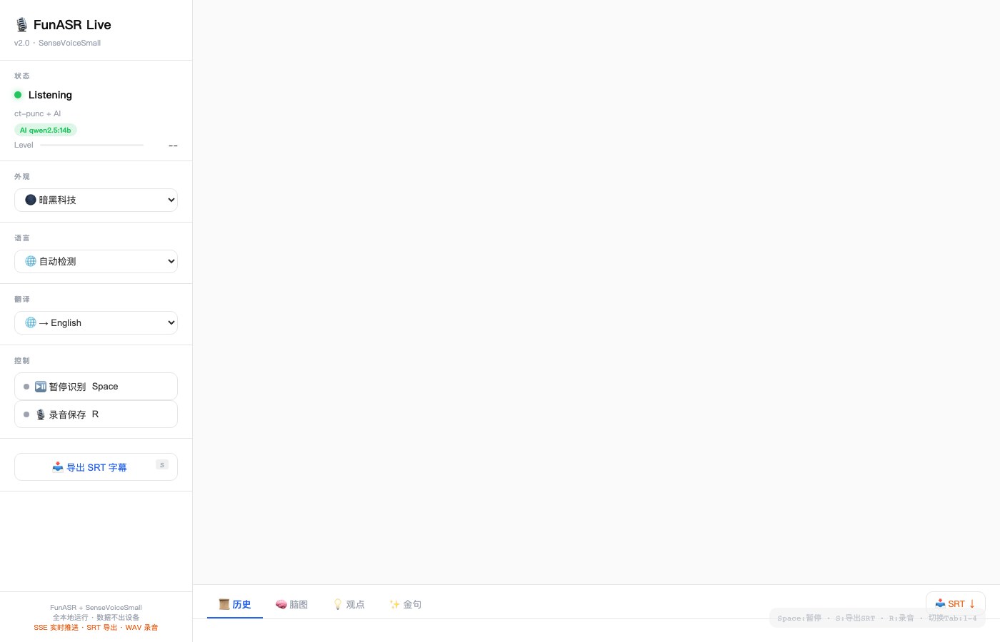

# 🎙️ FunASR Live v2.0

<p align="center">
  
  
  
  
  
  
</p>

<p align="center">
  <b>실시간 음성 인식, 바로 사용 가능.</b><br>
  단 하나의 Python 파일. 클라우드 불필요. 모든 기능 내장.
</p>

<p align="center">
  <a href="README.md">🇺🇸 English</a> · <a href="README_zh.md">🇨🇳 中文</a> · <a href="README_ja.md">🇯🇵 日本語</a> · <b>🇰🇷 한국어</b> · <a href="README_es.md">🇪🇸 Español</a> · <a href="README_fr.md">🇫🇷 Français</a> · <a href="README_de.md">🇩🇪 Deutsch</a> · <a href="README_pt.md">🇧🇷 Português</a> · <a href="README_ru.md">🇷🇺 Русский</a>
</p>

<p align="center">
  
</p>

---

## 왜 FunASR Live인가?

시중의 실시간 음성 인식 도구는 두 가지로 나뉩니다:

| | 클라우드 API | 데스크톱 앱 | **FunASR Live** |
|---|---|---|---|
| 개인정보 | ❌ 음성이 서버로 전송 | ✅ 로컬 | ✅ **100% 로컬, 네트워크 불필요** |
| 비용 | ❌ 분당 과금 | 💰 일회성 구매 | 🆓 **영구 무료** |
| 지연 | ⚠️ 1-3초 | ✅ 실시간 | ✅ **SSE 푸시, 100ms 미만** |
| 언어 | ✅ 50+ | ⚠️ 제한적 | ✅ **20+ 언어 자동 감지** |
| 자막 출력 | ⚠️ 별도 도구 필요 | ⚠️ 형식 고정 | ✅ **원클릭 SRT** |
| 오디오 녹음 | ❌ 미지원 | ✅ 지원 | ✅ **토글로 WAV 저장** |
| AI 요약 | ⚠️ API 추가 비용 | ❌ 드묾 | ✅ **내장 (Ollama)** |
| 커스터마이징 | ❌ 클로즈드 | ❌ 클로즈드 | ✅ **완전 소스, 20개 테마** |
| 배포 | N/A | 설치 프로그램 | 🚀 **단일 `.py` 파일** |

**최적의 균형:** 클라우드 API의 전문 기능 + 로컬 앱의 개인정보 보호 + 해킹 가능한 Python 파일.

---

## ✨ 기능

### 🎤 실시간 음성 인식
말하기 → 텍스트 즉시 표시. **Alibaba SenseVoiceSmall** + VAD + 문장부호 복원 모델 기반. 언어 자동 감지 또는 고정.

### ⚡ SSE 실시간 푸시
폴링 없음, 새로고침 없음. **Server-Sent Events**로 텍스트를 브라우저에 푸시, 100ms 미만 지연.

### 📥 SRT 자막 출력
원클릭(또는 `S` 키)으로 표준 `.srt` 자막 다운로드. Premiere, DaVinci Resolve 등에 바로 사용 가능.

### 🎙️ WAV 오디오 녹음
녹음 토글 ON → 모든 마이크 오디오를 데스크톱에 `.wav` 저장. OFF → 헤더 자동 수정, 즉시 사용 가능.

### 🧠 AI 요약 (Ollama)
[Ollama](https://ollama.com) 실행 시 AI가 자동 생성:
- **마인드맵** — 화제 시각화 트리
- **핵심 포인트** — 구조화된 요점 목록
- **명언 발췌** — 최고의 원문 인용

### 🌍 실시간 번역
언어 A 인식 → 언어 B로 즉시 번역. 20+ 언어 지원. Google 번역 기반, 설정 불필요.

### 🎨 20가지 테마
다크 모드뿐만 아니라. **20가지 엄선된 테마** — 사이버 그린, 네온 나이트, 미드나이트 잉크, 미니멀 화이트, 웜 페이퍼 등.

---

## 🚀 빠른 시작

```bash
pip install funasr deep-translator numpy
# 선택: AI 요약용 Ollama 설치
brew install ollama && ollama pull qwen2.5:14b
python3 funasr_live.py
open http://localhost:8765
```

초기 실행 시 약 400MB의 ASR 모델을 다운로드합니다(이후 캐시 사용).

---

## ⌨️ 단축키

| 키 | 기능 |
|------|------|
| `Space` | 인식 일시정지/재개 |
| `S` | SRT 자막 다운로드 |
| `R` | 녹음 ON/OFF |
| `1-4` | 탭 전환 |

---

## 📡 API

| 엔드포인트 | 설명 |
|-----------|------|
| `/events` | SSE 스트림 (실시간 푸시) |
| `/api` | 최신 결과 (폴링용) |
| `/config` | 설정 및 상태 |
| `/download/srt` | SRT 자막 다운로드 |
| `/toggle_pause` | 마이크 ON/OFF |
| `/toggle_record` | 녹음 ON/OFF |
| `/set_lang?mode=ko` | 언어 고정 |
| `/set_translate?target=en` | 번역 대상 설정 |

---

## 🔧 설정

`funasr_live.py` 상단의 `CONFIG` 편집:

```python
CONFIG = {
    "port": 8765,
    "chunk_seconds": 1.5,
    "sample_rate": 16000,
    "rms_threshold": 0.003,
    "bt_hfp_helper": True,
    "translate_enabled": True,
    "translate_target": "en",
}
```

---

## 🎯 활용 사례

| 장면 | 활용법 |
|------|--------|
| 회의 기록 | 녹음 + AI 요약 + SRT 출력 |
| 콘텐츠 제작 | 음성으로 스크립트 작성 |
| 언어 학습 | 발화 + 실시간 번역 |
| 접근성 | 프레젠테이션/통화 자막 |
| 인터뷰 조사 | WAV 녹음 + 타임스탬프 텍스트 |
| 영상 자막 | SRT 직접 생성 |
| 라이브 스트리밍 | UI를 자막 오버레이로 임베드 |

---

## 📦 의존성

```text
funasr >= 1.3.0
deep-translator >= 1.11
numpy >= 1.24
```

Node.js, Docker, CUDA 불필요. Python + pip만으로 OK.

---

## 📄 라이선스

MIT — 자유롭게 사용, 개조, 상업적 이용 가능.

---

<p align="center">
  <sub>❤️로 <a href="https://superk.ai">Mr.K Lab</a> 제작 · <a href="https://github.com/modelscope/FunASR">FunASR</a> 채택</sub>
</p>
